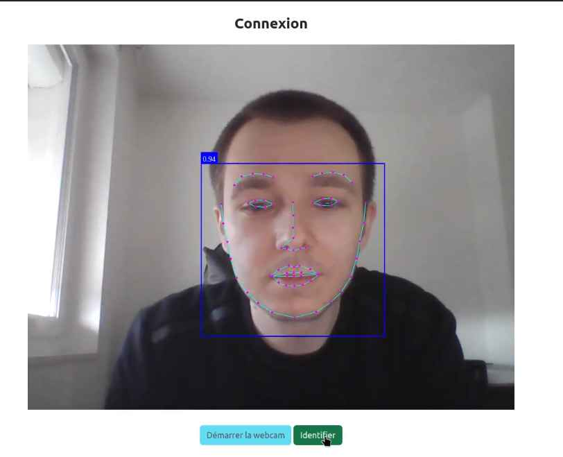

# **Facial Recognition Authentication**

This project is a web application that allows users to authenticate themselves using their face and password. It employs
facial recognition technique through [face-api.js](https://github.com/justadudewhohacks/face-api.js) based on
descriptors, which are arrays of 128 floating-point numbers representing facial features.
**No image files are stored on the server**, only the image descriptor.
Additionally, it utilizes a session token security system, ensuring user authenticity.

## **Technologies Used**

* PHP
* Symfony
* javascript
* HTML
* CSS

## **Installation**

To install and run this project, you need to have a web server compatible with PHP and Symfony, as well as a MySQL
database. You also need to have a modern web browser that supports webcam usage.

* Clone or download this repository to your web server.
* Create a MySQL database and import the **database.sql** file located in the **sql** folder.
* Modify the `.env` file located at the root of the project and provide the connection information for your database.
* Run the command `composer install` to install PHP dependencies.
* Run the command `php -S localhost:8000 -t public` to start the web server (or `symfony serve -d` but symfony cli is required).
* Open your web browser and access the project's URL.

## **Usage**

* Start by registering; you need to enter your email, username, password, and select a photo of yourself. A descriptor
  of your face will then be saved in the database.
* To log in, enter and validate your email address. Then, allow access to the webcam from your browser and proceed with
  identification. Your face will be compared to the descriptor stored in the database. If recognition is successful, the
  server creates a session token and sends it to the client. You will then need to enter your password to complete the
  login. The client's token is sent to the server, which compares it with the session token. I

If both tokens match, authentication is successful.

## **Settings**

### Similarity Threshold

The similarity threshold is the value that determines whether two faces are considered identical or not. The lower the
threshold, the stricter the recognition, and vice versa.

The similarity threshold is defined by a constant in the `SecurityController.php` class:

`const THRESHOLD = 0.43;`

You can modify this value according to your needs, adhering to the format of a floating-point number between 0 and 1.
For example, if you want to make recognition slightly more tolerant, you can increase the threshold to 0.5:

`const THRESHOLD = 0.5;`

### Expression and Gender Recognition

* #### Add Models on Load

In the **faceRecognition function,** uncomment the following lines:

`faceapi.nets.faceExpressionNet.load(modelPath),`

`faceapi.nets.ageGenderNet.load(modelPath)`

* #### Add Object Methods:

In the `startDetection` function, add object methods to the `detections` constant:

`\\ .withFaceExpressions()` et `\\ .withAgeAndGender();`

The constant will look like this:

`const detections = await faceapi.detectAllFaces(webcamElement, new faceapi.TinyFaceDetectorOptions()).withFaceLandmarks(true).withFaceExpressions().withAgeAndGender();`

* ##### Add Function Calls:

In the `startDetection` function, uncomment the function calls at the **end** of the `setInterval`:

    faceapi.draw.drawFaceExpressions(canvas, resizedDetections)
    resizedDetections.forEach(result => {
        const { age, gender, genderProbability } = result
        new faceapi.draw.DrawTextField(
            [
                `${Math.round(age, 0)} years`,
                `${gender} (${Math.round(genderProbability)})`
            ],
            result.detection.box.bottomRight
        ).draw(canvas)
    })

## Support

Show your ❤️ and support with a ⭐.

## License

**Facial Recognition Authentication** is licensed under the MIT License.